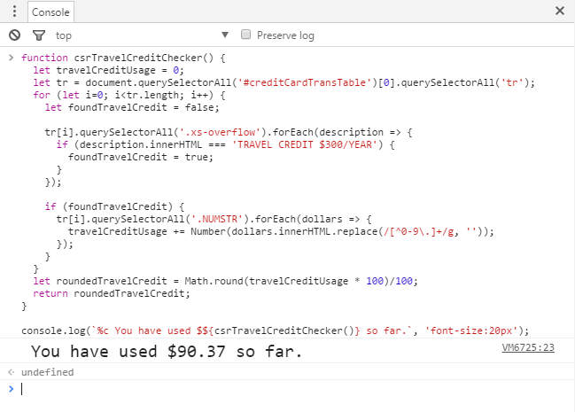

# CSR Travel Credit Checker

With the Chase Sapphire Reserve credit card, we get $300 worth of travel credit per year. However, there appears to be no way to check how much credit we have used up other than to manually add them up one by one. This script was written to help us easily check how much travel credit we have used.

## Usage

1. Log into chase.com and select the Chase Sapphire Reserve credit card.
2. Change the "Showing" filter to display "All transactions".
3. Copy the script in `script.js` and paste it into the web browser's developer console.
4. Press Enter to see how much travel credit you have used.

## How It Works

The script looks for a table with the ID of "creditCardTransTable". Each row is checked for the string "TRAVEL CREDIT $300/YEAR". If that specific string is found, the dollar amount from that row is saved to a running total. After all the rows are checked, the final total is displayed.
